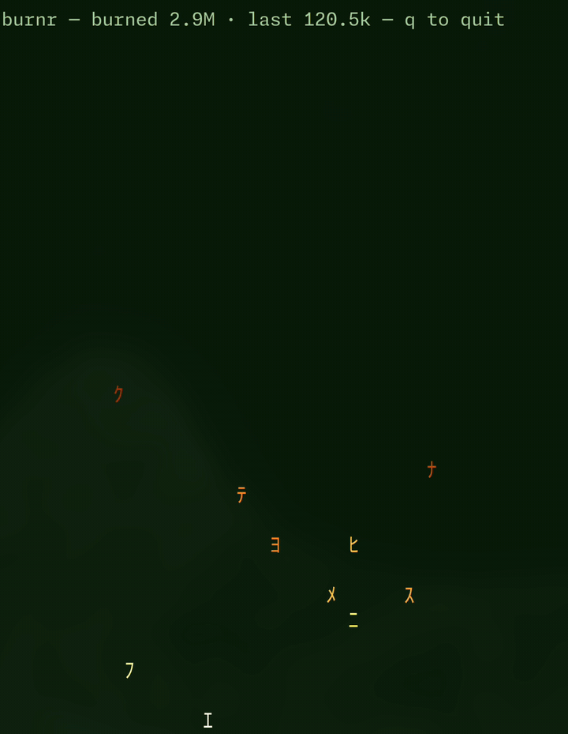

# burnr 🔥

A bonfire of glyphs in your terminal, burning the tokens your Claude Code session burns.

burnr attaches to your current project's live Claude Code session transcript and turns every
turn's token usage into a burst of rising, fading Matrix-style embers. Big turns blaze; quiet
sessions smoulder down to a gentle flicker. A status line keeps count.



## Install

```sh
cargo install burnr
```

## Usage

Run it from the project directory whose Claude Code session you want to watch:

```sh
burnr
```

It finds the latest session transcript under `~/.claude/projects/`, tails it live, and
rotates automatically when you start a fresh session. Press `q` to quit.

Run it in a tmux/terminal split beside Claude Code and watch your conversation burn.

### Options

```
burnr                        # watch the current directory's latest session
burnr --project <dir>        # watch another project's latest session
burnr --session <path>       # pin to one specific transcript (.jsonl)
burnr --demo                 # no ingestion; press space to fire synthetic bursts
```

### Status line

```
burnr — burned 1.2M · last 88.3k — q to quit
```

`burned` is the cumulative token count for the watched session — including cache reads,
which the model re-pays on every turn, so it grows much faster than your context size.
`last` is the most recent turn.

## Configuration

Optional, at `~/.config/burnr.toml`:

```toml
[idle]
after_seconds = 10.0             # settle to a flicker this long after the last burst
embers_per_second = 4.0          # gentle idle flicker rate
active_embers_per_second = 30.0  # ambient smoulder rate while the session is active
```

Every field is optional; unknown fields are ignored.

## How it works

Claude Code writes a JSONL transcript per session under
`~/.claude/projects/<slugified-project-path>/`. Each assistant message carries a usage
snapshot (input, output, cache-read and cache-creation tokens). burnr tails the newest
transcript, de-duplicates streaming snapshots, and maps each turn's total through a
log-scaled intensity curve — calibrated against a few thousand real turns — into particle
count and rise speed.

## Licence

MIT
